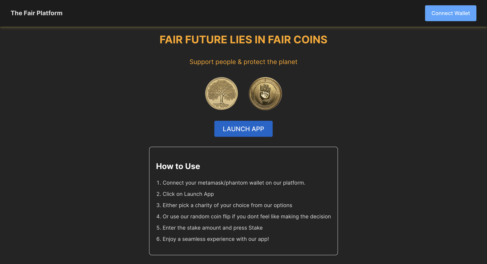
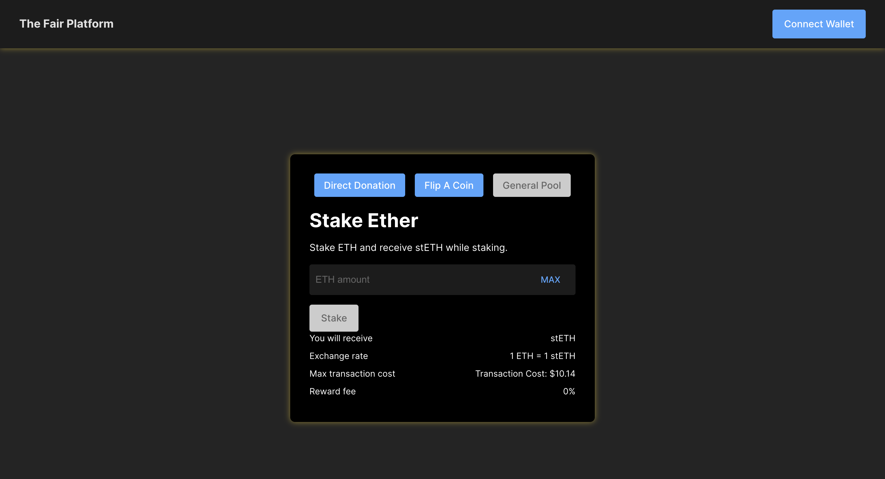

# eth-oxford: FairDAO
Repo for ETH oxford
Presentation Slides: [link](https://www.canva.com/design/DAF_HgzjCYI/goHU_-n1VYZmEhzQjPY8Ow/view?utm_content=DAF_HgzjCYI&utm_campaign=designshare&utm_medium=link&utm_source=editor)

Video Demo links:

Total Showcase:

Front end only:

Back end only: 


#### Summary
a novel approach to philanthropy, blockchain growth, and environmental sustainability. By harnessing the power of Ethereum staking and yield stripping, we propose an innovative system that automates donations to charitable causes and impactful initiatives, focusing on promoting blockchain adoption and supporting green initiatives Our platform not only incentivizes participation through governance tokens but also ensures that supporting global causes is seamless, efficient, and transparent.

#### Introduction
The intersection of blockchain technology and social good presents an untapped opportunity to address some of the world's most pressing challenges. Traditional fundraising and donation systems often face issues of inefficiency, lack of transparency, and limited engagement from younger, tech-savvy demographics. Our project aims to bridge this gap by leveraging Ethereum staking rewards as a sustainable source of funding for charities and initiatives that have a real-world impact.

#### Problem Statement
Charitable organizations and impactful initiatives such as workshops frequently struggle with securing consistent funding and engaging donors in a meaningful way, or are a massive endeavor requiring brand name. Additionally, the environmental impact of blockchain technologies, particularly in terms of energy consumption, has been a point of concern. There is a clear need for a solution that not only supports global causes but also promotes the sustainable growth of blockchain technology itself.

#### Our Solution
Our platform automates the process of donating Ethereum staking rewards to selected charities and initiatives. By staking ETH, users earn rewards, a portion of which can be automatically donated to their chosen cause. This process is facilitated through a user-friendly interface that simplifies the donation process, making philanthropy accessible to everyone.

##### Key Features:
- Automated Donations: Users can effortlessly donate their staking rewards to a variety of causes.
- Governance Tokens: Donors receive governance tokens, allowing them to vote on future initiatives and the distribution of funds.
- Support for Green Initiatives: A focus on funding projects that generate carbon credits, aligning blockchain innovation with environmental sustainability, and potentially unlocking a reward for donors.
- Incentive System: The more users donate, the more governance tokens they receive, enhancing their influence over the platform's direction.

#### Technical Innovation
At the core of our project is a set of smart contracts designed for Ethereum staking, automated donations, and governance token distribution. This technical framework ensures a secure, transparent, and efficient system for channeling funds to deserving causes. Our approach addresses the complexity of integrating blockchain technology with charitable giving, showcasing originality in solving a significant challenge.

#### Impact and Adoption
Our platform is poised to make a substantial impact by:
- Providing consistent funding to charities and initiatives focused on blockchain adoption and environmental sustainability.
- Engaging a broader demographic in philanthropy through a transparent, blockchain-based system.
- Promoting the sustainable growth of blockchain technology by supporting green initiatives and carbon credit generation.
- We aim to partner with organizations that can tangibly bring about carbon reducing activities, and blockchain education like EduDAO and EthOxford to support educational ecosystems and foster the next generation of blockchain innovators.

#### Conclusion
Our project represents a novel convergence of blockchain technology and social impact. By automating donations from Ethereum staking rewards, we offer a sustainable model for supporting global causes, driving blockchain adoption, and promoting environmental sustainability. We invite partners, investors, and the broader community to join us in making a tangible difference through blockchain technology.

## Tech Stack 
Two Smart Contract written in solidity and front end written in Reactjs, using ethers.js for interacting with the on-chain contract

## How to run 
- Clone the repo 
```bash
cd client
```
- Replace the ETHERSCAN_API_KEY in constants.js with your own API key (this is sued to fetch gas price, not necessarily needed for normal working of the app, might see some errors if not provided. The existing one in the project will deleted)
- cd into client (to bring the front end up on lcoalhost)
- run the following command
```bash
npm i 
```
 and then 

 ```bash
 npm run dev
 ```

- You should see front end come up on  http://localhost:5173/ (unless otherwise specificed)
- Intereact with the app, and have fun!

## Smart contracts
The public repo for smart contracts are here:
https://github.com/0xKubko/eth-oxford

## Images from the app Front-end
Landing Page


Staking Page


## Debug Tips 
- Run 'npm outdated' to check for outdated dependencies, and update them with 'npm update'.
- Ensure ETHERSCAN API key is repalaced (not necessarily needed, absence might result in basic errors and empty transaction cost on staker page)
- Use React DevTools or other browser developer tools to examine the component hierarchy and inspect component state.
- Search for similar issues on the project's GitHub repository or relevant online forums.

